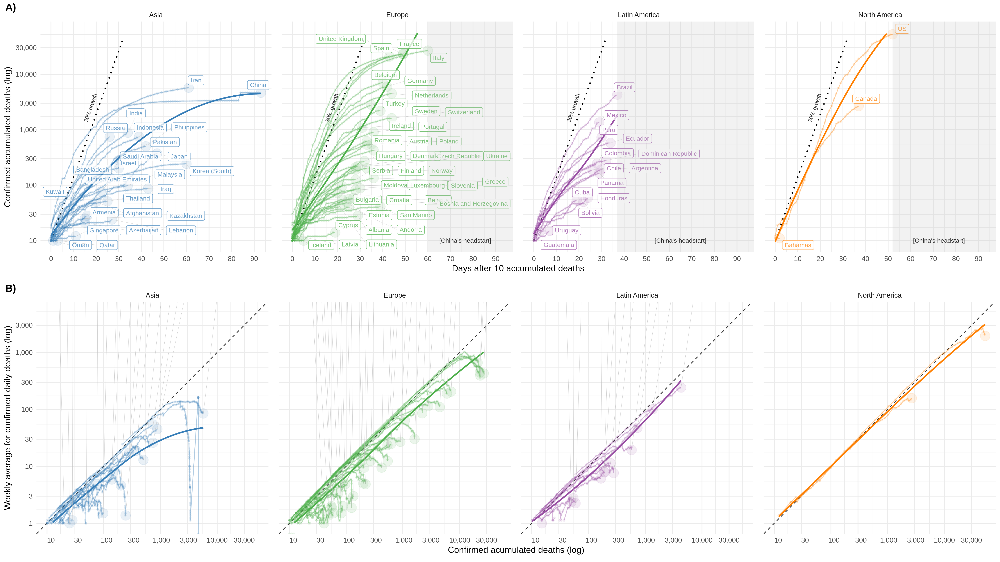

# Coronavirus LATAM tracker

Repository with R code for a plot and a Shiny app to interactively compare deaths by region using the @JHUSystems Coronavirus data.  The plot is featured in the following paper:  

**The impact of SARS-CoV-2 in dementia across Latin America: A call for urgent regional plan and coordinated response**  

Agustin Ibanez, Hernando Santamaria-Garcia, Alejandra Guerrero Barragan, Alyne Mendonca Marques Ton, Andrea Slachevsky, Antonio Lucio Teixeira*, Beatriz Marcela Mar Meza*, Cecilia M Serrano, Christopher Butler, Claudia Duran-Aniotz, Daisy Acosta*, Diana L Matallana, Dr Dominic Trépel*, Elisa De Paula França Resende, Fabricio Ferreira de Oliveira, Fernanda G. De Felice, Gorka Navarrete*, Ioannis Tarnanas, Irene B. Meier*, Jerusa Smid, Julian Bustin, Laís Fajersztajn*, Leonel Tadao Takada, Lissette Duque, Maria Aparecida Camargos Bicalho*, María Isabel Behrens, Maritza Pintado-Caipa*, Myriam De La Cruz Puebla*, Nilton Custodio, Rodrigo Santibanez, Rodrigo Bernardo Serafim, Ronnielly Melo Tavares, Stefanie Danielle Piña Escudero, Tomas Leon Rodriguez, Walter Dawson, Bruce Miller, Kenneth Kosik

  

Figure 1. Evolution patterns of Coronavirus deaths by regions and countries

A) Temporal dynamics of accumulated deaths.  The accumulated deaths grow over time for all the countries and regions by days since the first 10 reported deaths. The slope represents the rate of growth, and the length of the trajectory, the number of days since the death toll reached 10 for that country. This shows the time scale of the epidemic for each country and region. A dashed line of 30% growth in each region help to identify the similar growing rate across countries and regions.  A gray headset is shown to help visualize the time gap in comparison with the start of the COVID-19 outbreak in China. It can be appreciated how the LACs are, compared to most countries/regions, in the early days, although their growth is in line with Europe or North America.   

B) Exponential growth of confirmed daily deaths by countries and regions. Rate of change shown as daily new deaths (weekly average) divided by total deaths. Moving in the diagonal implies the growth rate is exponential. As we can appreciate, all regions except Asia are growing exponentially, with Europe stating to slowly deviate from the diagonal. Although the number of deaths is still low in most LACs (except Brazil), the rate of change is clearly exponential and resembling other regions. Plots present a line for each country, plus a bold line with a smooth conditional mean by region (using the loess method). Both panels show how the epidemic started relatively late in LACs, which gave them a time buffer to react. Despite this, the global trajectories of the regions clearly suggest exponential growth similar to Europe or North America.
           

---  

## Data sources

* Johns Hopkins CSSE (https://github.com/CSSEGISandData/COVID-19) through https://covid19api.com/

  

Please always check oficial sources (e.g. [WHO](https://www.who.int/emergencies/diseases/novel-coronavirus-2019)), and be careful when using this or other information to create predictive models.   

